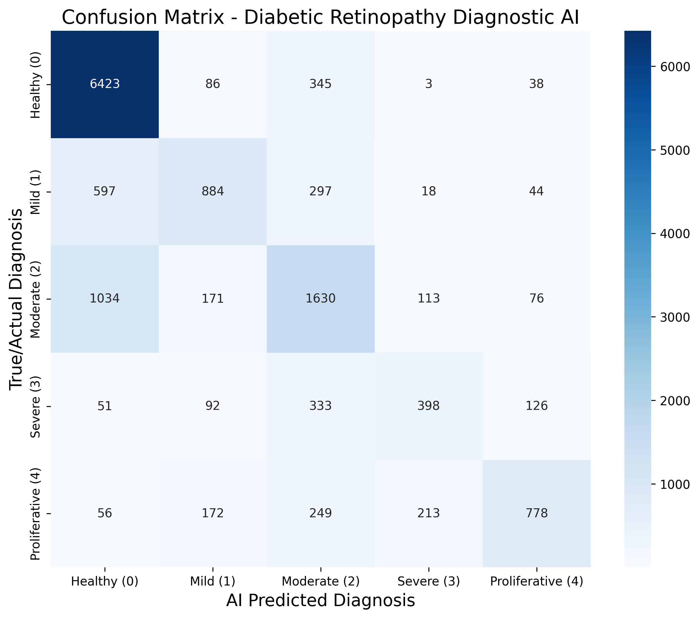

# 👁️ Diabetic Retinopathy Diagnostic AI (GWO-Optimized)

An end-to-end Deep Learning system that diagnoses Diabetic Retinopathy from retinal fundus images. This project features a custom EfficientNet model tuned using the **Grey Wolf Optimizer (GWO)** algorithm and includes a **Django** web dashboard for real-time inference and **Explainable AI (Grad-CAM)** visualizations.

## 🚀 Key Features
* **Deep Learning Architecture:** EfficientNet-B0 trained on a heavily augmented dataset across 5 clinical stages of the disease.
* **Swarm Intelligence Optimization:** Utilized a custom Grey Wolf Optimizer (GWO) script to dynamically find the mathematical optimum for Learning Rate and Dropout parameters, preventing memory overload and maximizing accuracy.
* **Explainable AI (XAI):** Integrated Grad-CAM to generate visual heatmaps. This allows medical professionals to see exactly which retinal lesions, exudates, or camera artifacts the AI focused on to make its diagnosis.
* **Web Dashboard:** A lightweight Django interface where users can upload raw images and instantly receive the diagnosis label, AI confidence score, and the visual heatmap.

## 🛠️ Tech Stack
* **AI/ML Core:** Python, TensorFlow, Keras, OpenCV, NumPy
* **Backend Web Server:** Django
* **Optimization:** Custom GWO Algorithm

## 📊 Model Performance & Evaluation
The model was evaluated against 14,227 validation images, yielding the following mathematical metrics:
* **Overall Accuracy:** 71.1%
* **Weighted F1-Score:** 0.70
* **Healthy Identification (Recall):** 93% (Highly effective at minimizing false positives for healthy patients)
* **Proliferative DR (Precision):** 73% (Strong reliability when flagging the most severe, dangerous stage of the disease)

**Confusion Matrix Results:**
The system effectively distinguishes baseline healthy eyes from severe pathology. Borderline cases (e.g., distinguishing Healthy vs. Mild DR) show expected clinical variance, which is explicitly mitigated in this system through the human-in-the-loop **Grad-CAM** visual verification.



## 💻 How to Run Locally
1. Clone the repository:
   ```bash
   git clone [https://github.com/PradeepKumar-369/Fundus-Diabetic-Retinopathy-AI.git](https://github.com/PradeepKumar-369/Fundus-Diabetic-Retinopathy-AI.git)